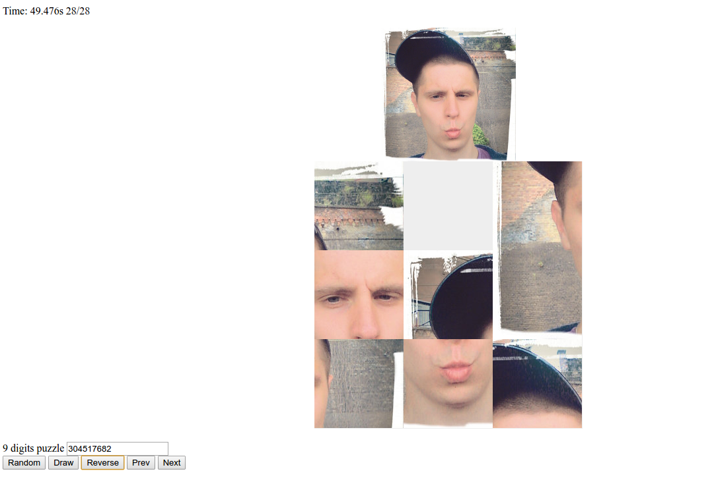

## To Use

To clone and run this repository you'll need [Git](https://git-scm.com) and [Node.js](https://nodejs.org/en/download/) (which comes with [npm](http://npmjs.com)) installed on your computer. From your command line:

```bash
# Clone this repository
git clone https://github.com/nnaisur/puzzle-3x3-a-star
# Go into the repository
cd puzzle-3x3-a-star
# Install dependencies
npm install
# Run the app
electron .
```
## Screenshot

